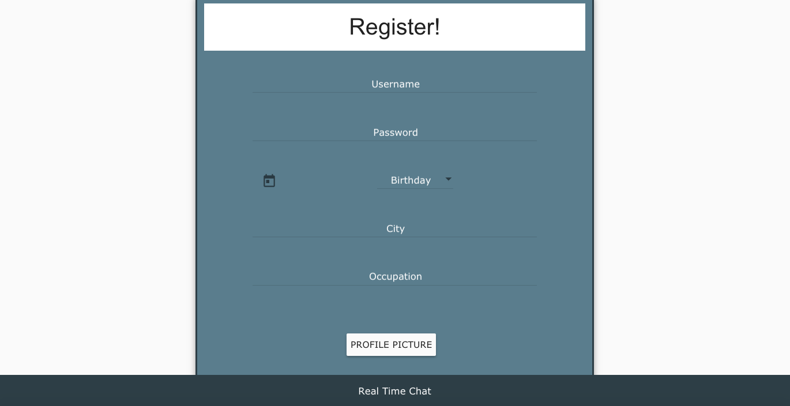
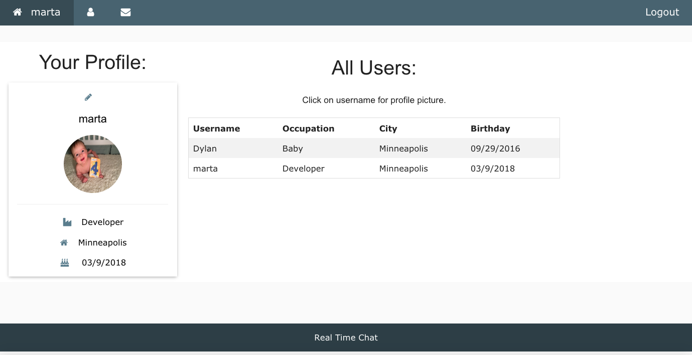
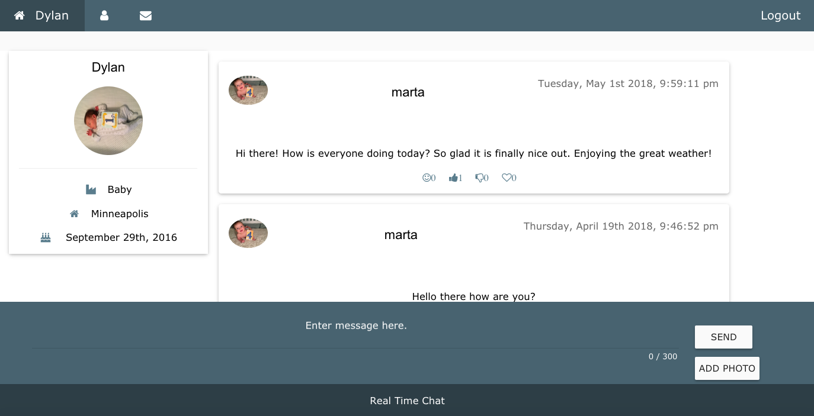
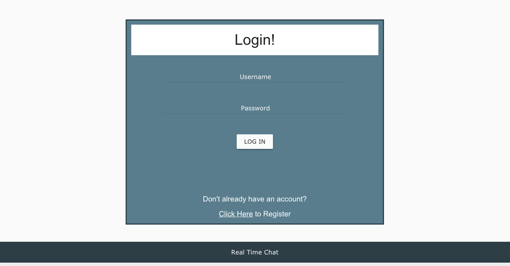

# Real Time Messaging

A real time messaging application with authentication, sockets and filestack. Users have the ability to create a profile, and send and read real time messages.

## Built With

- MongoDB
- Express
- AngularJS 
- Node.js
- Moment.js
- Angular Moment
- Angular Material for styling
- Passport for user authentication
- Socket.io
- Filestack

## Getting Started

### Prerequisites

Software that is required before you attempt to start the app.

- [Node.js](https://nodejs.org/en/)
- [Mongo](https://www.mongodb.com/download-center?jmp=tutorials&_ga=2.157987642.1691954874.1515639811-1798030591.1515639811#enterprise)
- Start Mongo and make sure it is up and running.

### Installing

Steps to get the development environment running:

1. Download this project.
2. `npm install`
3. `npm start`

## Screen Shot

### Completed Features

High level list of items completed.

- [x] Real time message updates utilizing socket.io
- [x] View Messages if logged in.
- [ ] A user can delete messages they created.
- [ ] A user can edit messages they created.
- [x] A user can post messages.
- [x] Users can post and edit their profile.

### Next Steps

Features that you would like to add at some point in the future.

- [x] Users may upload a profile picture.
- [x] Users may upload a picture as a message.
- [ ] Users may click on another user to see profile information.

## Authors

* Marta Jopp

## Acknowledgments

* Thank you to Prime Digital Academy for providing the Passport local strategy code